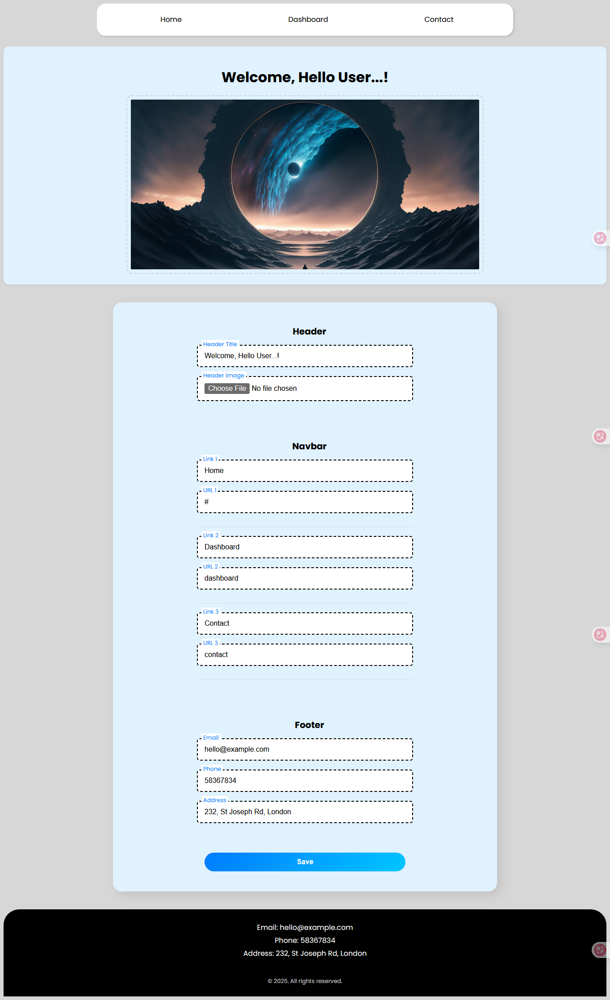

# Dashboard CMS 🧩

A simple CMS-style dashboard to **create**, **save**, and **fetch** customizable components like Header, Navbar, and Footer. Built with love using the MERN stack.

---

## 🖼️ Screenshot



---

## 🚀 Features

- Add and customize:
  - Header title and image
  - Navigation links
  - Footer contact info
- Save components to MongoDB
- Fetch and load the latest saved data
- Built with modular and clean code architecture
- Responsive frontend using Tailwind CSS

---

## 🛠️ Tech Stack

**Frontend:**

- React + Vite
- Axios
- Tailwind CSS

**Backend:**

- Node.js
- Express.js
- MongoDB + Mongoose

---

## 📦 Clone and Run Locally

### 1. Clone the repo

```bash
git clone https://github.com/MohammadhRimaz/Cloud-Dashboard.git
```

### 2. Set up the backend

```bash
cd backend
npm install
```

- Create a .env file inside /backend:

```bash
MONGO_URI=your_mongo_connection_string
```

- Run the backend server:

```bash
node server.js
```

- The backend is running on http://localhost:5000/api/components

### 3. Set up the frontend

```bash
cd ../
npm install
npm run dev
```

- The dashboard is running on http://localhost:5173/

## 📁 Folder Structure

```bash
root
├── backend
│   ├── models
│   ├── routes
│   ├── server.js
│   └── .env
|──  src
│── vite.config.js
└── README.md
```
